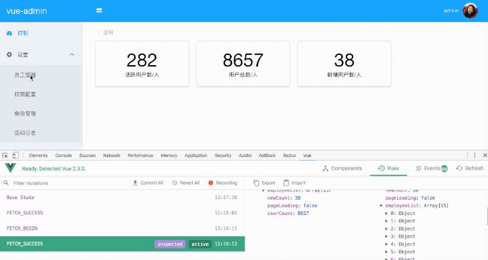

# vue-admin-generator

> 这并不是一个脚手架项目，是一个基础demo项目，剥离了实际业务的参考项目。新建vue后台项目，可以在本项目基础上修改。

## TodoList

- [x] 使用Mockjs模拟接口数据(待完善)

- [x] axios实现网络请求(后续封装统一错误处理)

- [x] vuex状态管理

- [ ] 路由权限控制

## Demo

 在线 [Demo](https://jibenziliao.github.io/vue-admin-generator)

 用户名:admin

 密码:123456

 可登录的用户在${root_project}/src/mock/data/exampleData.js中

 

 

 

## Description

  1. 全局通用的Vuex状态管理，可参考src/vuex/modules/control.js内的配置，所有的异步请求都共用一个action和固定的三个mutation方法。

  2. 至于Vuex的state状态管理，则写在Vue模板内方法的回调里，这样可以共用代码，避免大量相似的代码。

  3. 所有的网络请求也共用一个axios.request()方法，请求类型，成功回调，都以参数的形式传入请求中，同样避免了大量相似代码出现。

  4. 对比参考案例请查看调用的登录请求及员工管理中获取员工列表请求。

## Build Setup

``` bash
# install dependencies
npm install

# serve with hot reload at localhost:8080
npm run dev

# build for production with minification
npm run build

# build for production and view the bundle analyzer report
npm run build --report
```

For detailed explanation on how things work, checkout the [guide](http://vuejs-templates.github.io/webpack/) and [docs for vue-loader](http://vuejs.github.io/vue-loader).
