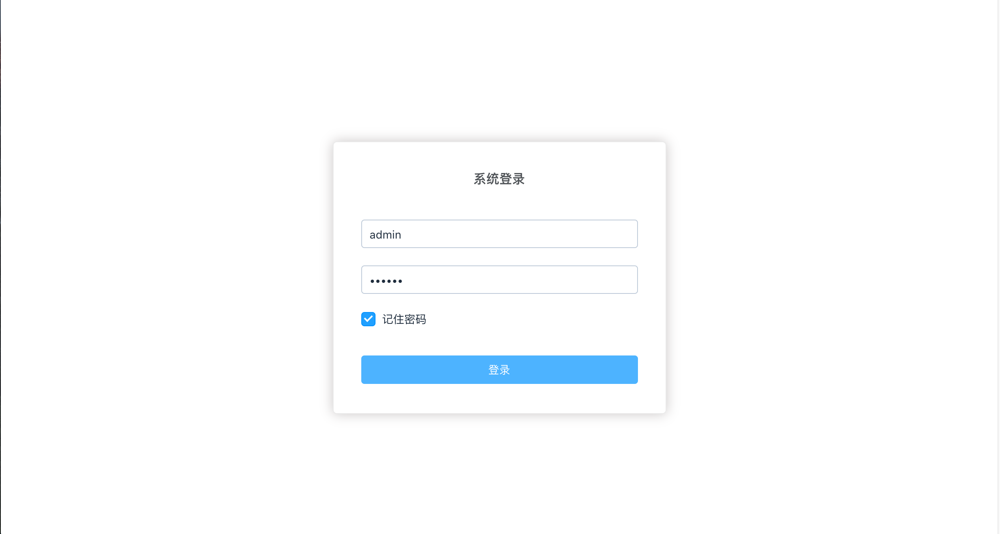

# vue-admin-generator

> 这并不是一个脚手架项目，是一个基础demo项目，剥离了实际业务的参考项目。新建vue后台项目，可以在本项目基础上修改。

## Description

- [x] 使用Mockjs模拟接口数据(待完善)

- [x] axios实现网络请求(后续封装统一错误处理)

- [x] vuex状态管理(目前每个请求都有请求开始、请求成功、请求失败三种状态，比较麻烦，正在想办法优化)

- [] 路由权限控制

## Demo

 在线[Demo](https://jibenziliao.github.io/vue-admin-generator)

 用户名:admin

 密码:123456

 可登录的用户在${root_project}/src/mock/data/exampleData.js中

 

 

## Build Setup

``` bash
# install dependencies
npm install

# serve with hot reload at localhost:8080
npm run dev

# build for production with minification
npm run build

# build for production and view the bundle analyzer report
npm run build --report
```

For detailed explanation on how things work, checkout the [guide](http://vuejs-templates.github.io/webpack/) and [docs for vue-loader](http://vuejs.github.io/vue-loader).
